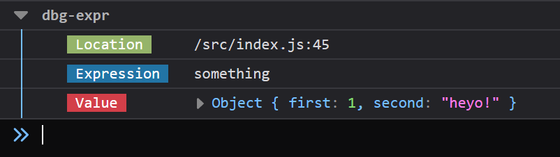

<h2 align="center">Debug</h2>

A helper for evalutating and logging an expression at the same time. Idea taken from [Rust dbg! macro](https://doc.rust-lang.org/std/macro.dbg.html).


Instead of separating "working" logic in order to log out individual pieces, use this function to log the expression and value in place!

---

## Features

- display called location (file and line number)
- show unevaluated expression (with variable names intact!)
- value of expression result
- returns value so it can be used in place! (very useful - see examples)

---

## Installation

```bash
# yarn
$ yarn add -D debug

# npm
$ npm install --save-dev debug
```

_Please note that the **\$** character above is to denote use in a terminal. The command will fail if you enter that character when installing._

---

## Usage

Just import the function and call it around an expression, either on its own line or an existing line.

For example:

```js
import dbg from 'dbg-expr';

// on its own line (like console.log())
dbg(() => 4 - 1); // [/src/index.js:16] 4 - 1 = 3

// on an existing line
const value = 8 * dbg(() => 1 + 1); // [/src/index.js:44] 1 + 1 = 2

// using named variables
const age = api.getUser().age;
dbg(() => age); // [/models/user.js:25] age = 30
```

That last one is easier to type than:

```js
console.log('age', age);
```

---

---

## Log Format

The output format depends on whether you are logging to a terminal in Node vs the browser console via client-side JavaScript.

Node:
`[location] expression = value`

Client-side:


---

---

## FAQ

### But why??

Well, I believe this has multiple benefits. An incomplete list might be:

1. It's less to type 😊.
1. If you want to log the output of a function, you would normally have to run the function twice: once to log the value and another to return the value. This could have adverse affects (ie: a non-immutable action like dispatching);
1. Logging part of an expression. What if you want to see the value of the whole object, but then return only a property? This would mean you have to separate it into a variable, log the variable, and then continue on - like returning it; logging in-place solves this! Here's an example that illustrates how easy this package makes it!

```js
// data coming from somewhere else
const people = [
  { first: 'Andy', last: 'Taylor' },
  { first: 'Opie', last: 'Taylor' },
  { first: 'Barney', last: 'Fife' },
  { first: 'Otis', last: 'Campbell' },
];

// original code
const uppercaseFirstNames = people.map(person => person.first.toUpperCase());

// verbose console.log() code
const uppercaseFirstNames = people.map(person => {
  const firstName = person.first;
  console.log('firstName', firstName);
  return firstName.toUpperCase();
});

// concise code by just wrapping in dbg()
const uppercaseFirstNames = people.map(person => dbg(() => person.first).toUpperCase());
```

### Why do I need to pass in a function?

You'll notice that the expression is wrapped in a function. This is the only way to keep the expression **unevaluated** and logged out for you! If you pass only the expression, you'll still see the location and value, but not the stringified expression.

### Why does the logged expression look so much different than my code? / Why am I not seeing a file location and line number?

You may have uglify/minify enabled in your bundler or framework which alters the output significantly. See the [section below](#disable-uglify-/-minify-in-development) for help on this.

### Do I have to use ES6 arrow functions?

You may have noticed that all of the examples above are using ES6 arrow functions. You may also use regular anonymous functions with the `function` keyword, like so:

```js
var variable = 98;

// [/src/index.js:8] variable + 1 = 99
dbg(function() {
  return variable + 1;
});
```

### Can I globally define this?

Currently you could attach this function to whatever long-lived object you wish, such as the client-side `window` object. Perhaps this is done in a Nuxt client-side plugin.

---

---

## Disable Uglify / Minify in Development

This is the key to making this work well in some cases.. Below is a list of popular frameworks and setups and how you can disable these features in development. If you figure it out for one that is not listed, please submit a PR so others can benefit!

- [Nuxt JS (Vue)](https://github.com/nuxt/nuxt.js/issues/250#issuecomment-280681399)

- [Next JS (React)](https://gist.githubusercontent.com/arunoda/b4f8df6e2f12263aa6210265761aef67/raw/a8a11e51ac883a8a82a57c1a41a9236563172e40/next.config.js)
